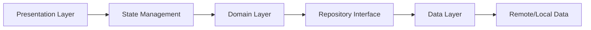

# 🛒 متجر تضامن | Tadamon Shop

<div align="center">


**الدليل التقني المرجعي لفريق التطوير**
حقوق الملكية © 2026 - فريق متجر تضامن

</div>

---

## 📋 نظرة عامة (Executive Summary)

يُعد مشروع **متجر تضامن** منصة تجارة إلكترونية متطورة تهدف إلى تقديم تجربة مستخدم استثنائية. تم تصميم البنية البرمجية للمشروع لتكون عالية الكفاءة (High Performance)، قابلة للتوسع (Scalable)، وسهلة الصيانة (Maintainable)، وذلك بالاعتماد على أحدث ممارسات هندسة البرمجيات.

---

## ⛔ بروتوكول إدارة الكود (Code Gameplay & Governance)

> [!CAUTION]
> **قاعدة صارمة:** أي مخالفة لتعليمات الـ Git Flow التالية قد تؤدي إلى رفض عملك وإغلاق الـ Pull Request تلقائياً. يرجى القراءة بعناية.

نعتمد استراتيجية صارمة لإدارة الفروع لضمان استقرار البيئة الإنتاجية:

### 1. خريطة الفروع (Branching Strategy)

| الفرع | الوصف الفني | الصلاحيات |
| :--- | :--- | :--- |
| **`main`** | **البيئة الإنتاجية (Production Environment)**.<br>يحتوي فقط على كود مستقر تماماً ومختبر. | 🚫 **ممنوع اللمس**<br>(Direct Push Blocked) |
| **`dev`** | **بيئة التطوير (Development Environment)**.<br>هو الفرع المركزي لدمج الميزات قبل إطلاقها. | ✅ **نقطة الانطلاق والدمج**<br>(Base & Target Branch) |
| `feat/*` | فروع الميزات الجديدة (Features). | ✅ مسموح |
| `fix/*` | فروع إصلاح الأخطاء (Bug Fixes). | ✅ مسموح |

---

## 🚀 دليل الانضمام وبدء العمل (Onboarding Guide)

للبدء في المساهمة، اتبع هذا التسلسل الخوارزمي بدقة:

### المرحلة الأولى: تهيئة البيئة (Environment Setup)

1. **استنساخ المستودع (Clone Repository):**

    ```bash
    git clone https://github.com/Ahmed-sherif11/tadamon_shop.git
    cd tadamon_shop
    ```

2. **التبديل لفرع التطوير (Switch to Dev Strategy):** ⚠️
    الوقوف الافتراضي يكون على `main`. هذا محظور للعمل. انتقل فوراً لـ `dev`:

    ```bash
    git checkout dev
    ```

3. **تثبيت الاعتمادات وتشغيل التطبيق:**

    ```bash
    flutter pub get
    flutter run
    ```

---

### المرحلة الثانية: دورة حياة التطوير (Development Cycle Workflow)

عند تكليفك بمهمة (Task)، اتبع الخطوات التالية حرفياً:

#### 1. المزامنة (Sync)

قبل كتابة أي سطر كود، تأكد أن نسختك محدثة لتجنب التضارب (Conflicts):

```bash
git checkout dev
git pull origin dev
```

#### 2. التفريع (Branching)

قم بإنشاء فرع جديد يعبر عن المهمة (استخدم `feat` للميزات و `fix` للأخطاء):

```bash
git checkout -b feat/user-authentication-ui
```

#### 3. التطوير والحفظ (Commit Standard)

اعمل على الكود، ثم احفظ التغييرات برسالة توضيحية تتبع معايير **Conventional Commits**:

```bash
git add .
git commit -m "feat: implement login screen layout and widgets"
```

#### 4. الرفع (Pushing)

ارفع الفرع إلى الـ Remote Repository:

```bash
git push origin feat/user-authentication-ui
```

#### 5. طلب الدمج (Pull Request)

* اذهب لصفحة المشروع على GitHub.
* قم بإنشاء **Pull Request**.
* ⚠️ **Base Branch:** يجب أن يكون **`dev`** (وليس `main`).
* اطلب مراجعة الكود (Code Review) من الزملاء.

---

## 🏗️ الهندسة المعمارية (Architecture Breakdown)

نطبق نمط **Feature-First Clean Architecture** بدقة لضمان فصل الاهتمامات (Separation of Concerns).



### هيكلية الملفات (Directory Structure)

* **`core/`**: يحتوي على الكود المشترك (Extensions, Error Models, Network Services). هذا المجلد هو العمود الفقري للمشروع.
* **`config/`**: يحتوي على إعدادات التطبيق العامة (Themes, Routes, Strings, Assets).
* **`features/`**: المجلد الرئيسي حيث يتم بناء الميزات. كل ميزة (مثلاً `auth`) تحتوي على طبقاتها الخاصة:
  * `data/`: (DataSource, Repos Repository Impl, Models).
  * `domain/`: (Entities, UseCases, Repository Contract).
  * `presentation/`: (UI Pages, Widgets, BLoCs).

---

## 🛠️ المكدس التقني (Technology Stack)

تم اختيار أدواتنا لضمان الأداء، الاستقرار، وسهولة التطوير:

| المجال | التقنية / المكتبة | الغرض |
| :--- | :--- | :--- |
| **Framework** | Flutter SDK | بناء واجهات مستخدم تفاعلية وعالية الأداء. |
| **State Mgt** | BLoC / Cubit | إدارة حالة التطبيق بطريقة يمكن التنبؤ بها واختبارها. |
| **Networking** | Dio | عميل HTTP قوي يدعم Interceptors و Global Error Handling. |
| **DI** | GetIt & Injectable | حقن الاعتماديات لتقليل التماسك (Coupling). |
| **Functional** | Dartz | التعامل مع الأخطاء باستخدام `Either<Failure, Success>`. |
| **UI** | ScreenUtil | ضمان دقة التصميم وتجاوبه (Pixel-Perfect) على كل الشاشات. |
| **Fonts** | Cairo | الخط العربي الرسمي المعتمد للتطبيق. |

---

## ⚖️ بروتوكول الفريق (General Engineering Rules)

1. **Code Quality**: يمنع منعاً باتاً ترك `print` statements أو `unused code` في الـ Pull Request.
2. **Formatting**: الالتزام بتنسيق الكود القياسي لـ Dart (`dart format .`).
3. **Naming**:
    * المتغيرات والدوال: `camelCase`
    * الكلاسات: `PascalCase`
    * الملفات: `snake_case`
4. **Language**: اللغة الإنجليزية هي اللغة الوحيدة المسموح بها في تسمية المتغيرات والتعليقات البرمجية (Comments).

---

> **Note to Contributors:**
> This repository is a strict professional environment. Deviation from these guidelines will result in rejected contributions. Happy Coding! 🚀
